Vagrant-стенд c OSPF

Цель домашнего задания
Создать домашнюю сетевую лабораторию. Научится настраивать протокол OSPF в Linux-based системах.


Описание домашнего задания
1. Развернуть 3 виртуальные машины
2. Объединить их разными vlan
- настроить OSPF между машинами на базе Quagga;
- изобразить ассиметричный роутинг;
- сделать один из линков "дорогим", но что бы при этом роутинг был симметричным.


# 1. Разворачиваем 3 виртуальные машины

Так как мы планируем настроить OSPF, все 3 виртуальные машины должны быть соединены между собой (разными VLAN), а также иметь одну (или несколько) доолнительных сетей, к которым, далее OSPF сформирует маршруты. Исходя из данных требований, мы можем нарисовать топологию сети:

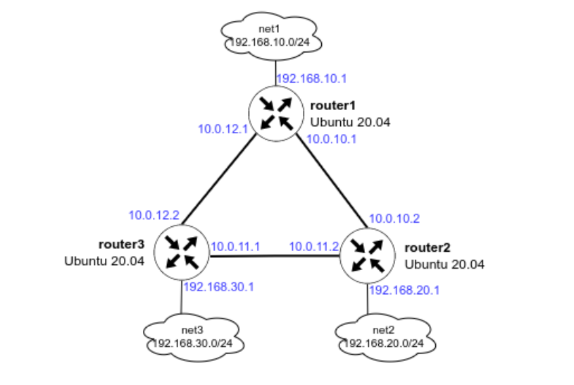

Обратите внимание, сети, указанные на схеме не должны использоваться в Oracle Virtualbox, иначе Vagrant не сможет собрать стенд и зависнет. По умолчанию Virtualbox использует сеть 10.0.2.0/24. Если была настроена другая сеть, то проверить её можно в настройках программы: VirtualBox — File — Preferences — Network — щёлкаем по созданной сети

Результатом выполнения данной команды будут 3 созданные виртуальные машины, которые соединены между собой сетями (10.0.10.0/30, 10.0.11.0/30 и 10.0.12.0/30). У каждого роутера есть дополнительная сеть:

- на router1 — 192.168.10.0/24
- на router2 — 192.168.20.0/24
- на router3 — 192.168.30.0/24


# Установка пакетов для тестирования и настройки OSPF

Перед настройкой FRR рекомендуется поставить базовые программы для изменения конфигурационных файлов (vim) и изучения сети (traceroute, tcpdump, net-tools):
```
sudo apt update

sudo apt install vim traceroute tcpdump net-tools -y
```
# 2.1 Настройка OSPF между машинами на базе Quagga

Пакет Quagga перестал развиваться в 2018 году. Ему на смену пришёл пакет FRR, он построен на базе Quagga и продолжает своё развитие. В данном руководстве настойка OSPF будет осуществляться в FRR. 

Процесс установки FRR и настройки OSPF вручную:

1) Отключаем файерволл ufw и удаляем его из автозагрузки:
```
   sudo systemctl stop ufw 

   sudo systemctl disable ufw
```
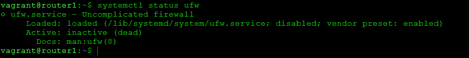

2) Добавляем gpg ключ:
```
   curl -s https://deb.frrouting.org/frr/keys.asc | sudo apt-key add -
```
3) Добавляем репозиторий c пакетом FRR:
```
   echo "deb https://deb.frrouting.org/frr $(lsb_release -s -c) frr-stable" | sudo tee /etc/apt/sources.list.d/frr.list

   curl -s https://deb.frrouting.org/frr/keys.asc | sudo apt-key add -

   sudo apt update

```
4) Обновляем пакеты и устанавливаем FRR:
```
   sudo apt update
   
   sudo apt install frr frr-pythontools
```
5) Разрешаем (включаем) маршрутизацию транзитных пакетов:
```
sudo sysctl net.ipv4.conf.all.forwarding=1
```
6) Включаем демон ospfd в FRR
Для этого открываем в редакторе файл /etc/frr/daemons и меняем в нём параметры для пакетов zebra и ospfd на yes:
```
sudo vim /etc/frr/daemons

zebra=yes
ospfd=yes
bgpd=no
ospf6d=no
ripd=no
ripngd=no
isisd=no
pimd=no
ldpd=no
nhrpd=no
eigrpd=no
babeld=no
sharpd=no
pbrd=no
bfdd=no
fabricd=no
vrrpd=no
pathd=no
```
В примере показана только часть файла

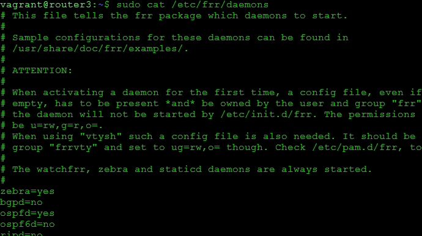


7) Настройка OSPF
Для настройки OSPF нам потребуется создать файл /etc/frr/frr.conf который будет содержать в себе информацию о требуемых интерфейсах и OSPF. Разберем пример создания файла на хосте router1. 


Для начала нам необходимо узнать имена интерфейсов и их адреса. Сделать это можно с помощью двух способов:
Посмотреть в linux: ip a | grep inet 
```
root@router1:~# ip a | grep "inet " 
    vagrant@router1:~$ ip a | grep inet
    inet 127.0.0.1/8 scope host lo
    inet 10.0.2.15/24 metric 100 brd 10.0.2.255 scope global dynamic eth0
    inet6 fd17:625c:f037:2:a00:27ff:fee8:487c/64 scope global dynamic mngtmpaddr noprefixroute
    inet6 fe80::a00:27ff:fee8:487c/64 scope link
    inet 10.0.10.1/30 brd 10.0.10.3 scope global eth1
    inet6 fe80::a00:27ff:feae:83b1/64 scope link
    inet 10.0.12.1/30 brd 10.0.12.3 scope global eth2
    inet6 fe80::a00:27ff:fe4f:73db/64 scope link
    inet 192.168.10.1/24 brd 192.168.10.255 scope global eth3
    inet6 fe80::a00:27ff:feb3:ada5/64 scope link
    inet 192.168.50.10/24 brd 192.168.50.255 scope global eth4
    inet6 fe80::a00:27ff:fe8a:e81e/64 scope link
root@router1:~# 
```

Зайти в интерфейс FRR и посмотреть информацию об интерфейсах

```
vtysh
```

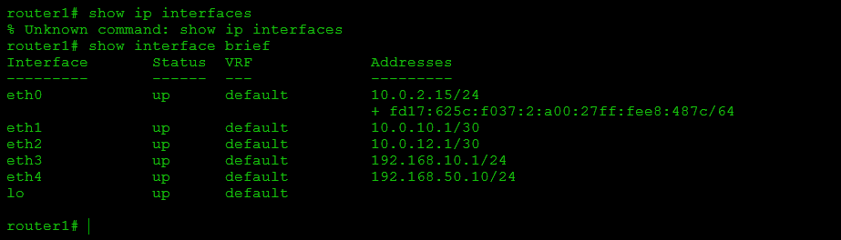

В обоих примерах мы увидем имена сетевых интерфейсов, их ip-адреса и маски подсети. Исходя из схемы мы понимаем, что для настройки OSPF нам достаточно описать интерфейсы eth1, eth2, eth3


Создаём файл /etc/frr/frr.conf и вносим в него следующую информацию:

```
!Указание версии FRR
frr version 8.1
frr defaults traditional
!Указываем имя машины
hostname router1
log syslog informational
no ipv6 forwarding
service integrated-vtysh-config
!
!Добавляем информацию об интерфейсе enp0s8
interface eth1
 !Указываем имя интерфейса
 description r1-r2
 !Указываем ip-aдрес и маску (эту информацию мы получили в прошлом шаге)
 ip address 10.0.10.1/30
 !Указываем параметр игнорирования MTU
 ip ospf mtu-ignore
 !Если потребуется, можно указать «стоимость» интерфейса
 !ip ospf cost 1000
 !Указываем параметры hello-интервала для OSPF пакетов
 ip ospf hello-interval 10
 !Указываем параметры dead-интервала для OSPF пакетов
 !Должно быть кратно предыдущему значению
 ip ospf dead-interval 30
!
interface eth2
 description r1-r3
 ip address 10.0.12.1/30
 ip ospf mtu-ignore
 !ip ospf cost 45
 ip ospf hello-interval 10
 ip ospf dead-interval 30

interface eth3
 description net_router1
 ip address 192.168.10.1/24
 ip ospf mtu-ignore
 !ip ospf cost 45
 ip ospf hello-interval 10
 ip ospf dead-interval 30 
!
!Начало настройки OSPF
router ospf
 !Указываем router-id 
 router-id 1.1.1.1
 !Указываем сети, которые хотим анонсировать соседним роутерам
 network 10.0.10.0/30 area 0
 network 10.0.12.0/30 area 0
 network 192.168.10.0/24 area 0 
 !Указываем адреса соседних роутеров
 neighbor 10.0.10.2
 neighbor 10.0.12.2

!Указываем адрес log-файла
log file /var/log/frr/frr.log
default-information originate always
```

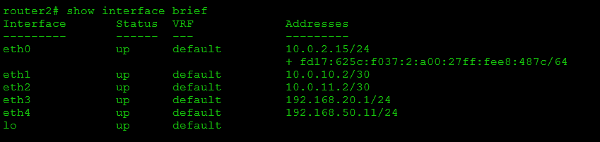

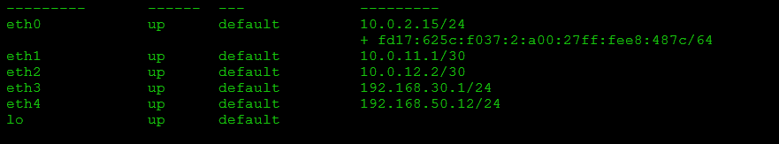

Сохраняем изменения и выходим из данного файла. 

Вместо файла frr.conf мы можем задать данные параметры вручную из vtysh. Vtysh использует cisco-like команды.
 
На хостах router2 и router3 также потребуется настроить конфигруационные файлы, предварительно поменяв ip -адреса интерфейсов. 

В ходе создания файла мы видим несколько OSPF-параметров, которые требуются для настройки:


- hello-interval — интервал который указывает через сколько секунд протокол OSPF будет повторно отправлять запросы на другие роутеры. Данный интервал должен быть одинаковый на всех портах и роутерах, между которыми настроен OSPF. 
- Dead-interval — если в течении заданного времени роутер не отвечает на запросы, то он считается вышедшим из строя и пакеты уходят на другой роутер (если это возможно). Значение должно быть кратно hello-интервалу. Данный интервал должен быть одинаковый на всех портах и роутерах, между которыми настроен OSPF.
- router-id — идентификатор маршрутизатора (необязательный параметр), если данный параметр задан, то роутеры определяют свои роли по  данному параметру. Если данный идентификатор не задан, то роли маршрутизаторов определяются с помощью Loopback-интерфейса или самого большого ip-адреса на роутере.


После создания файлов /etc/frr/frr.conf и /etc/frr/daemons нужно проверить, что владельцем файла является пользователь frr. Группа файла также должна быть frr. Должны быть установленны следующие права:
у владельца на чтение и запись
у группы только на чтение
```
ls -l /etc/frr
```

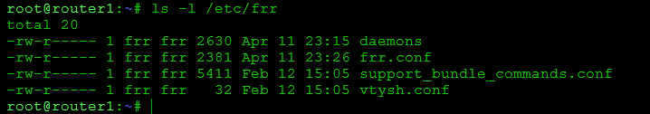


Если права или владелец файла указан неправильно, то нужно поменять владельца и назначить правильные права, например:
```
chown frr:frr /etc/frr/frr.conf 

chmod 640 /etc/frr/frr.conf 
```
- Перезапускаем FRR и добавляем его в автозагрузку
```
systemctl restart frr

systemctl enable frr
```

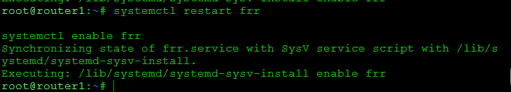


# Проверям, что OSPF перезапустился без ошибок

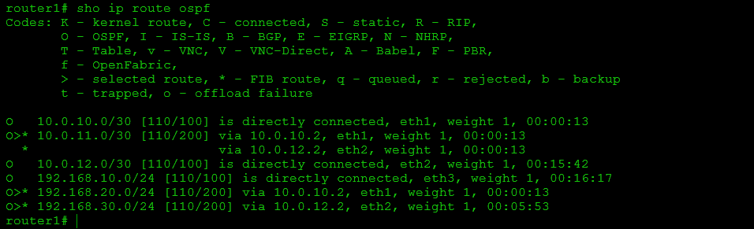

Попробуем отключить интерфейс eth2 и немного подождем и снова запустим трассировку до ip-адреса 192.168.30.1

```
router1# show ip route ospf
Codes: K - kernel route, C - connected, S - static, R - RIP,
       O - OSPF, I - IS-IS, B - BGP, E - EIGRP, N - NHRP,
       T - Table, v - VNC, V - VNC-Direct, A - Babel, F - PBR,
       f - OpenFabric,
       > - selected route, * - FIB route, q - queued, r - rejected, b - backup
       t - trapped, o - offload failure

O   10.0.10.0/30 [110/100] is directly connected, eth1, weight 1, 00:00:17
O>* 10.0.11.0/30 [110/200] via 10.0.10.2, eth1, weight 1, 00:00:17
  *                        via 10.0.12.2, eth2, weight 1, 00:00:17
O   10.0.12.0/30 [110/100] is directly connected, eth2, weight 1, 00:12:23
O   192.168.10.0/24 [110/100] is directly connected, eth3, weight 1, 00:12:23
O>* 192.168.20.0/24 [110/200] via 10.0.10.2, eth1, weight 1, 00:00:17
O>* 192.168.30.0/24 [110/200] via 10.0.12.2, eth2, weight 1, 00:12:14
router1# conf t
router1(config)# interface eth2
router1(config-if)# shutdown
router1(config-if)# end
router1# show ip route
Codes: K - kernel route, C - connected, S - static, R - RIP,
       O - OSPF, I - IS-IS, B - BGP, E - EIGRP, N - NHRP,
       T - Table, v - VNC, V - VNC-Direct, A - Babel, F - PBR,
       f - OpenFabric,
       > - selected route, * - FIB route, q - queued, r - rejected, b - backup
       t - trapped, o - offload failure

C>* 10.0.2.0/24 [0/100] is directly connected, eth0, 00:13:06
K>* 10.0.2.2/32 [0/100] is directly connected, eth0, 00:13:06
O   10.0.10.0/30 [110/100] is directly connected, eth1, weight 1, 00:00:59
C>* 10.0.10.0/30 is directly connected, eth1, 00:01:00
O>* 10.0.11.0/30 [110/200] via 10.0.10.2, eth1, weight 1, 00:00:10
O>* 10.0.12.0/30 [110/300] via 10.0.10.2, eth1, weight 1, 00:00:10
O   192.168.10.0/24 [110/100] is directly connected, eth3, weight 1, 00:13:05
C>* 192.168.10.0/24 is directly connected, eth3, 00:13:06
O>* 192.168.20.0/24 [110/200] via 10.0.10.2, eth1, weight 1, 00:00:59
O>* 192.168.30.0/24 [110/300] via 10.0.10.2, eth1, weight 1, 00:00:10
C>* 192.168.50.0/24 is directly connected, eth4, 00:13:06
router1# ping 192.168.30.1
PING 192.168.30.1 (192.168.30.1) 56(84) bytes of data.
64 bytes from 192.168.30.1: icmp_seq=1 ttl=63 time=0.989 ms
64 bytes from 192.168.30.1: icmp_seq=2 ttl=63 time=1.32 ms
64 bytes from 192.168.30.1: icmp_seq=3 ttl=63 time=1.16 ms
^C
--- 192.168.30.1 ping statistics ---
3 packets transmitted, 3 received, 0% packet loss, time 2002ms
rtt min/avg/max/mdev = 0.989/1.157/1.324/0.136 ms
router1# sh int br
Interface       Status  VRF             Addresses
---------       ------  ---             ---------
eth0            up      default         10.0.2.15/24
                                        + fd17:625c:f037:2:a00:27ff:fee8:487c/64
eth1            up      default         10.0.10.1/30
eth2            down    default
eth3            up      default         192.168.10.1/24
eth4            up      default         192.168.50.10/24
lo              up      default

router1#
```


# 2.2 Настройка ассиметричного роутинга

Для настройки ассиметричного роутинга нам необходимо выключить блокировку ассиметричной маршрутизации:
```
sysctl net.ipv4.conf.all.rp_filter=0
```
Далее, выбираем один из роутеров, на котором изменим «стоимость интерфейса». Например поменяем стоимость интерфейса eth1 на router1:

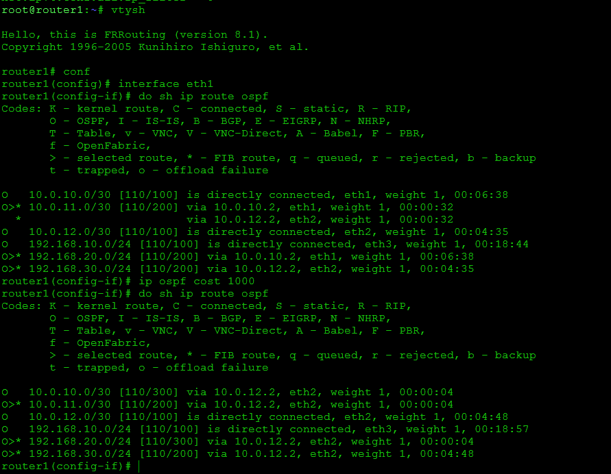


После внесения данных настроек, мы видим, что маршрут до сети 192.168.20.0/30  теперь пойдёт через router2, но обратный трафик от router2 пойдёт по другому пути. Давайте это проверим:


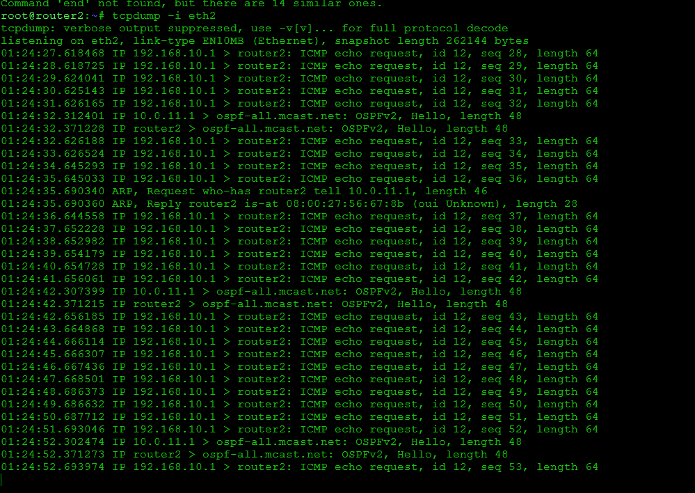

Видим что данный порт только получает ICMP-трафик с адреса 192.168.10.1


На router2 запускаем tcpdump, который будет смотреть трафик только на порту eth1:


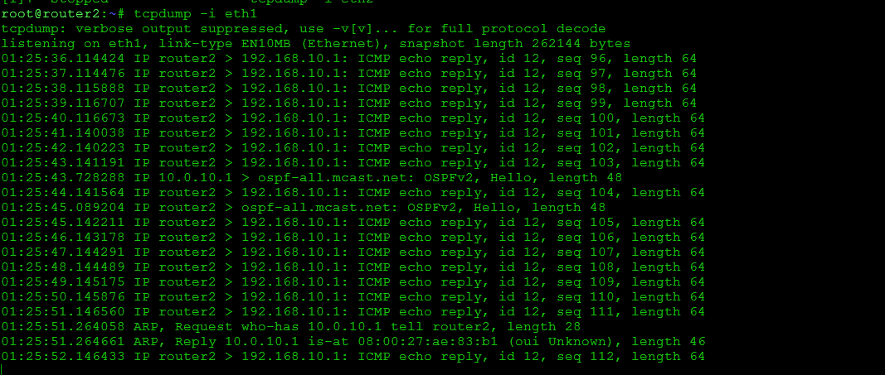


Видим что данный порт только отправляет ICMP-трафик на адрес 192.168.10.1


Таким образом мы видим ассиметричный роутинг.


# 2.3 Настройка симметичного роутинга


Так как у нас уже есть один «дорогой» интерфейс, нам потребуется добавить ещё один дорогой интерфейс, чтобы у нас перестала работать ассиметричная маршрутизация. 

Так как в прошлом задании мы заметили что router2 будет отправлять обратно трафик через порт eth1, мы также должны сделать его дорогим и далее проверить, что теперь используется симметричная маршрутизация:

Поменяем стоимость интерфейса eth1 на router2:

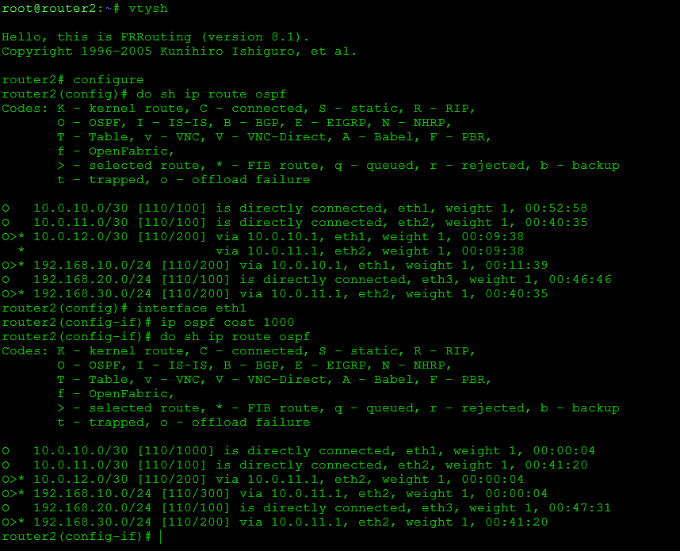

После внесения данных настроек, мы видим, что маршрут до сети 192.168.10.0/30  пойдёт через router2.

Давайте это проверим:

1) На router1 запускаем пинг от 192.168.10.1 до 192.168.20.1: 
```
ping -I 192.168.10.1 192.168.20.1
```
2) На router2 запускаем tcpdump, который будет смотреть трафик только на порту eth2:

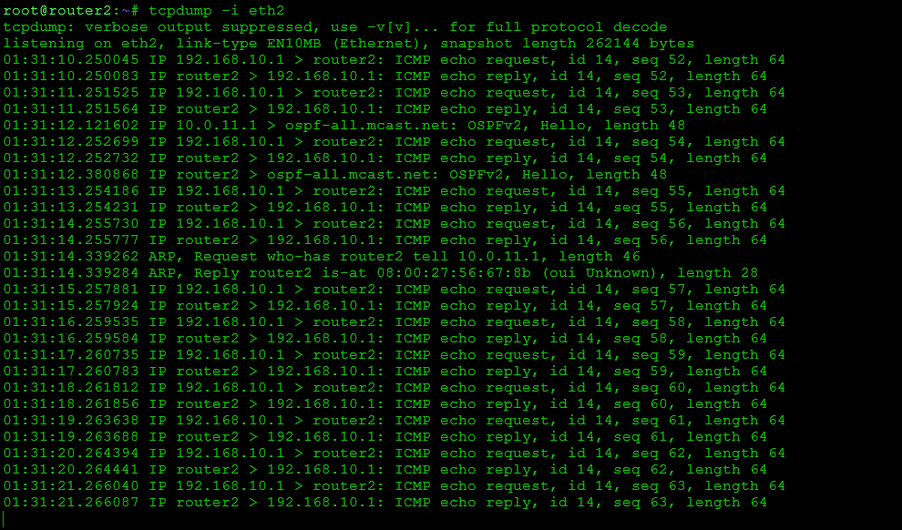


Теперь мы видим, что трафик между роутерами ходит симметрично.
