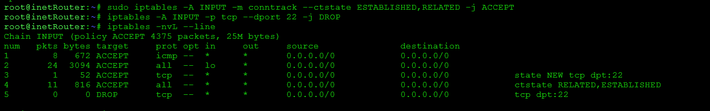
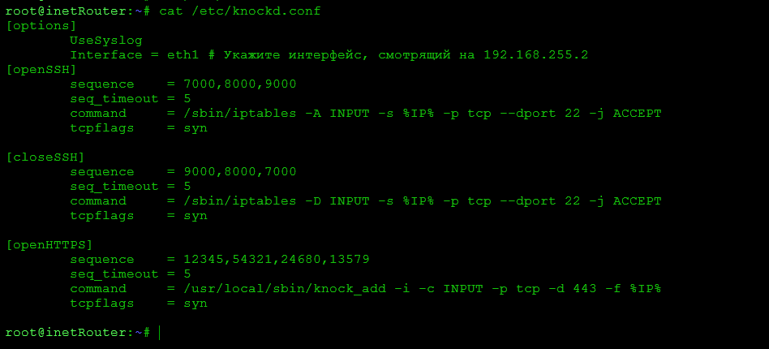
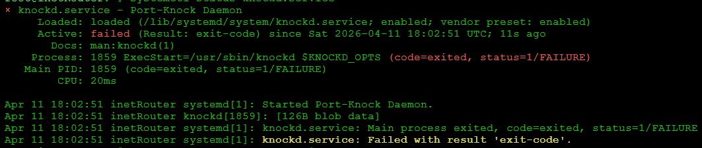
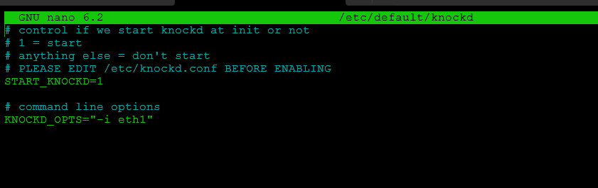
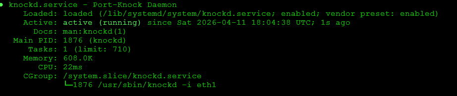
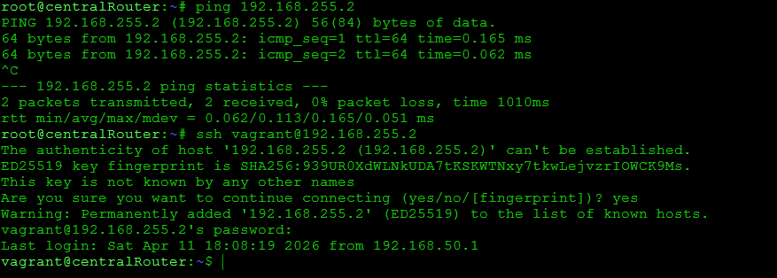
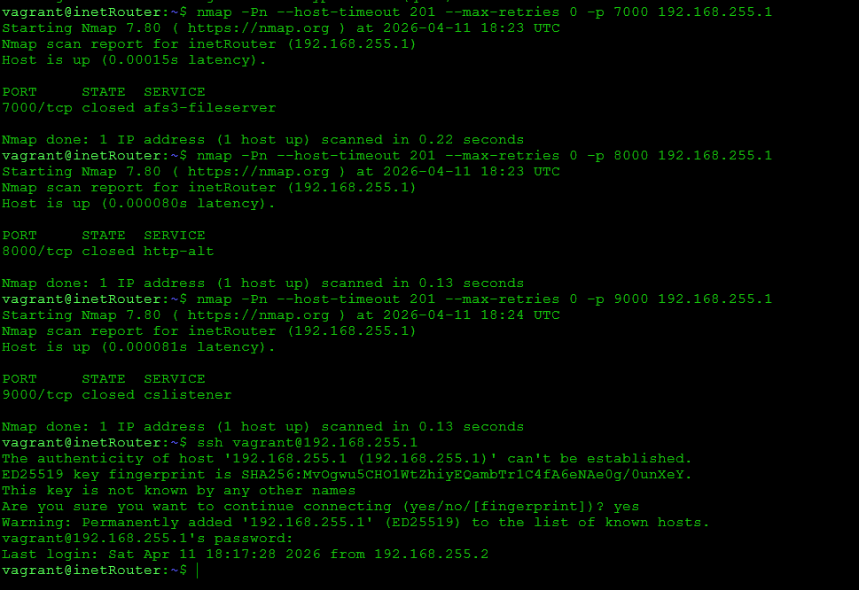

# otus_iptables
Фильтрация трафика - iptables
Домашнее задание
Сценарии iptables

Цель:
Написать сценарии iptables.

Описание/Пошаговая инструкция выполнения домашнего задания:
Что нужно сделать?

- реализовать knocking port
   centralRouter может попасть на ssh inetrRouter через knock скрипт
   пример в материалах.
- добавить inetRouter2, который виден(маршрутизируется (host-only тип сети для виртуалки)) с хоста или форвардится порт через локалхост.
- запустить nginx на centralServer.
- пробросить 80й порт на inetRouter2 8080.
- дефолт в инет оставить через inetRouter.

Формат сдачи ДЗ - vagrant + ansible

Реализовать проход на 80й порт без маскарадинга*

# Шаг 1: Подготовка inetRouter

sudo apt update
sudo apt install knockd iptables-persistent -y

# Шаг 2: Настройка правил брандмауэра

Нам нужно разрешить уже установленные соединения, но запретить новые попытки подключения к SSH (порт 22).

# Разрешаем Loopback и текущие сессии
sudo iptables -A INPUT -i lo -j ACCEPT
sudo iptables -A INPUT -m conntrack --ctstate ESTABLISHED,RELATED -j ACCEPT

# Закрываем SSH для новых соединений
sudo iptables -A INPUT -p tcp --dport 22 -j DROP

# Шаг 3: Конфигурация knockd

Редактируем файл /etc/knockd.conf. Мы настроим последовательность портов (например, 7000, 8000, 9000), при которой iptables будет временно открывать порт для отправителя.

# Шаг 4: Запуск демона

Включим автозапуск в /etc/default/knockd:

sudo sed -i 's/START_KNOCKD=0/START_KNOCKD=1/' /etc/default/knockd

Запускаем сервис:

sudo systemctl restart knockd
sudo systemctl enable knockd

Сервис не запустился

нужно исправить ощибку в конфигруции и указать интерфейс 

sudo nano /etc/default/knockd

KNOCKD_OPTS="-i eth1"

sudo systemctl restart knockd

# Шаг 5: Проверка с centralRouter

Теперь переходим на centralRouter (192.168.255.2). Сначала пробуем подключиться напрямую — соединение должно «зависнуть» или прерваться.

Затем устанавливаем клиент для стука (если его нет) и выполняем «стук»:

sudo apt install knockd -y
knock 192.168.255.1 7000 8000 9000
или

nmap -Pn --host-timeout 201 --max-retries 0 -p 7000 192.168.255.1 #прослушивание порта 7000
nmap -Pn --host-timeout 201 --max-retries 0 -p 8000 192.168.255.1 #прослушивание порта 8000
nmap -Pn --host-timeout 201 --max-retries 0 -p 9000 192.168.255.1 #прослушивание порта 97000

После этого сразу пробуем SSH:

ssh vagrant@192.168.255.1

# Резюме для проверки:
- Логи: На inetRouter можно смотреть tail -f /var/log/syslog, чтобы видеть, как knockd распознает последовательность.
- Безопасность: Чтобы доступ закрылся автоматически, в knockd.conf часто используют одну секцию со временем ожидания (stop_command и cmd_timeout), но ручное закрытие (обратная последовательность) — более надежный вариант для лабораторной работы.