# otus_iptables
Фильтрация трафика - iptables
Домашнее задание
Сценарии iptables

Цель:
Написать сценарии iptables.


Описание/Пошаговая инструкция выполнения домашнего задания:
Что нужно сделать?

- реализовать knocking port
   centralRouter может попасть на ssh inetrRouter через knock скрипт
   пример в материалах.
- добавить inetRouter2, который виден(маршрутизируется (host-only тип сети для виртуалки)) с хоста или форвардится порт через локалхост.
- запустить nginx на centralServer.
- пробросить 80й порт на inetRouter2 8080.
- дефолт в инет оставить через inetRouter.

Формат сдачи ДЗ - vagrant + ansible


Реализовать проход на 80й порт без маскарадинга*

# Шаг 1: Подготовка inetRouter


sudo apt update
sudo apt install knockd iptables-persistent -y

# Шаг 2: Настройка правил брандмауэра

Нам нужно разрешить уже установленные соединения, но запретить новые попытки подключения к SSH (порт 22).

# Разрешаем Loopback и текущие сессии
sudo iptables -A INPUT -i lo -j ACCEPT
sudo iptables -A INPUT -m conntrack --ctstate ESTABLISHED,RELATED -j ACCEPT

# Закрываем SSH для новых соединений
sudo iptables -A INPUT -p tcp --dport 22 -j DROP


# Шаг 3: Конфигурация knockd

Редактируем файл /etc/knockd.conf. Мы настроим последовательность портов (например, 7000, 8000, 9000), при которой iptables будет временно открывать порт для отправителя.


# Шаг 4: Запуск демона

Включим автозапуск в /etc/default/knockd:

sudo sed -i 's/START_KNOCKD=0/START_KNOCKD=1/' /etc/default/knockd

Запускаем сервис:


sudo systemctl restart knockd
sudo systemctl enable knockd

Сервис не запустился


нужно исправить ощибку в конфигруции и указать интерфейс 

sudo nano /etc/default/knockd

KNOCKD_OPTS="-i eth1"


sudo systemctl restart knockd


# Шаг 5: Проверка с centralRouter

Теперь переходим на centralRouter (192.168.255.2). Сначала пробуем подключиться напрямую — соединение должно «зависнуть» или прерваться.

Дорабатываем команду для временного открытыя порта 

```
/bin/sh -c '/sbin/iptables -I INPUT -p tcp -s %IP% --dport 22 -j ACCEPT; echo "/sbin/iptables -D INPUT -p tcp -s %IP% --dport 22 -j ACCEPT" | /usr/bin/at now + 2 minutes'
```

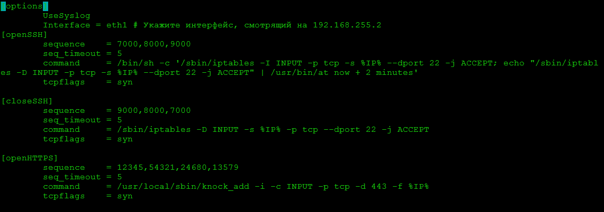

Затем устанавливаем клиент для стука (если его нет) и выполняем «стук»:

sudo apt install knockd -y


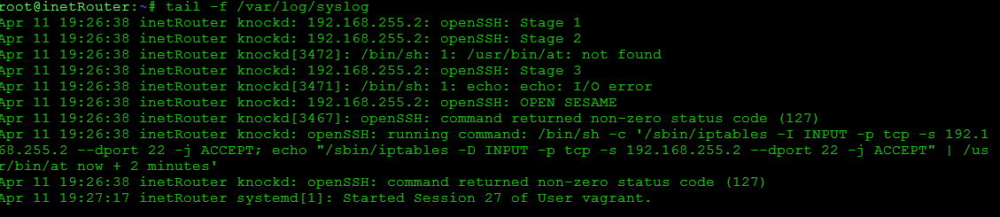

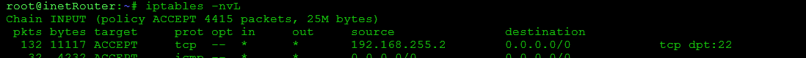

или

```
nmap -Pn --host-timeout 201 --max-retries 0 -p 7000 192.168.255.1 #прослушивание порта 7000
nmap -Pn --host-timeout 201 --max-retries 0 -p 8000 192.168.255.1 #прослушивание порта 8000
nmap -Pn --host-timeout 201 --max-retries 0 -p 9000 192.168.255.1 #прослушивание порта 9000
```
После этого сразу пробуем SSH:

ssh vagrant@192.168.255.1


# Резюме для проверки:

- Логи: На inetRouter можно смотреть tail -f /var/log/syslog, чтобы видеть, как knockd распознает последовательность.

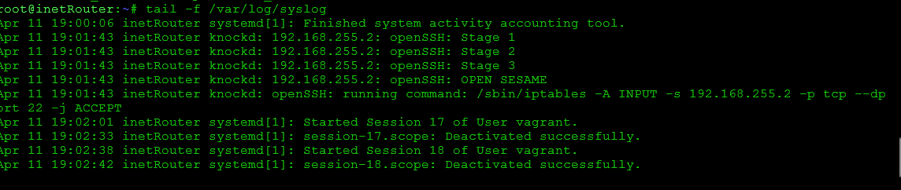

- Безопасность: Чтобы доступ закрылся автоматически, в knockd.conf часто используют одну секцию со временем ожидания (stop_command и cmd_timeout)


# Добавить inetRouter2, который виден(маршрутизируется (host-only тип сети для виртуалки)) с хоста или форвардится порт через локалхост.

Добавляем хост в наш vagrantfile и запускаем с host-only тип сети для виртуалки

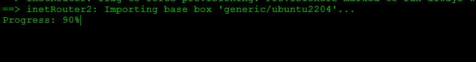


# Нужно получить такую схему: centralServer выходит в интернет по умолчанию через inetRouter

- ставим дефолт через inetRouter
```
ip route del default via 10.0.2.2 dev eth0 proto dhcp src 10.0.2.15 metric 100
ip route add default via 192.168.255.2 dev eth1
traceroute 8.8.8.8
```


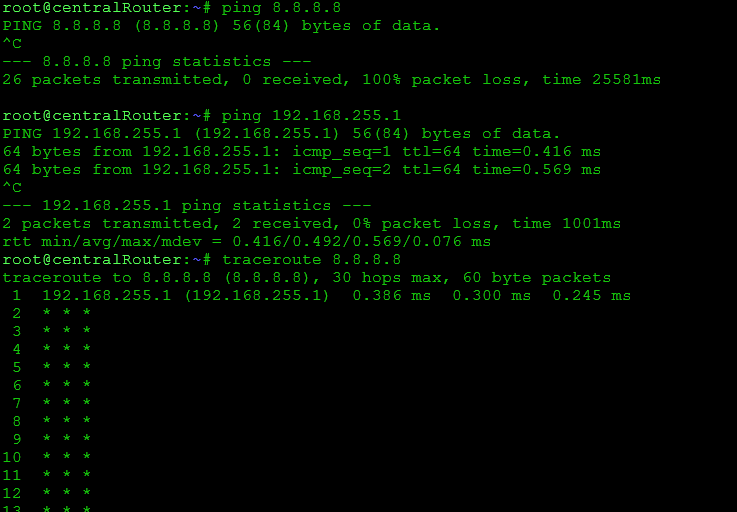


Видим что нет интернета, добавляем правило нат для сети 192.168.255.0/30

```
iptables -t nat -A POSTROUTING -s 192.168.255.0/30 -o eth0 -j MASQUERADE 
- Главное действие. Роутер заменяет внутренний IP-адрес устройства на свой внешний адрес eth0. Это позволяет устройствам из локальной сети выходить в интернет, используя один публичный IP роутера.

iptables -A FORWARD -i eth1 -o eth0 -j ACCEPT
- Разрешить это действие. Без этой команды роутер просто отбросит чужой пакет из внутренней сети.

 iptables -A FORWARD -i eth0 -o eth1 -m conntrack --ctstate ESTABLISHED,RELATED -j ACCEPT
- Этим правилом мы закрываем сеть от нежелательных входящих соединений извне, разрешая только «ответные» данные.
```

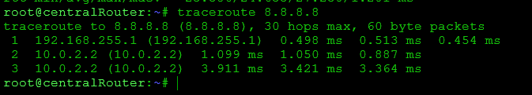


Проверяем доступ к inetRouter2 через host only

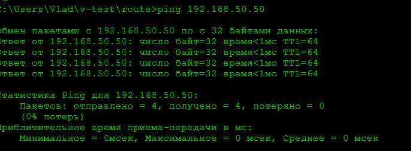

# Запустить nginx на centralServer.

sudo apt update
sudo apt install nginx -y

sudo systemctl status nginx

curl http://127.0.0.1


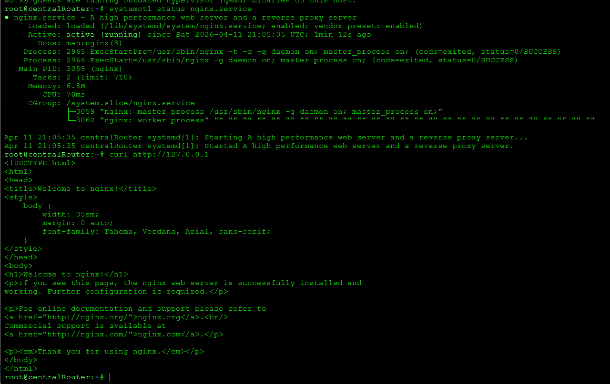


# проброс порта на inetRouter2.

Логика такая: на inetRouter2 входящий трафик на 8080 должен перенаправляться на centralServer:80

inetRouter2:

```
sudo iptables -t nat -A PREROUTING -i eth0 -p tcp --dport 8080 -j DNAT --to-destination 192.168.50.11:80
добавляет правило перенаправления входящих TCP-пакетов, которые приходят на порт 8080. Она меняет адрес назначения на 192.168.50.11:80, то есть отправляет трафик на внутренний сервер

sudo iptables -A FORWARD -p tcp -d 192.168.50.11 --dport 80 -j ACCEPT
разрешает системе пропускать TCP-пакеты, которые направляются к серверу 192.168.50.11 на порт 80. Без этого правила перенаправленный трафик может быть заблокирован фильтрующими правилами

sudo iptables -A FORWARD -p tcp -s 192.168.50.11 --sport 80 -m conntrack --ctstate ESTABLISHED,RELATED -j ACCEPT
разрешает обратный трафик от сервера, который приходит с порта 80. Она нужна, чтобы ответы внутреннего сервера могли беспрепятственно вернуться к клиенту через этот шлюз.


нужен ещё и обратный NAT на выходе
sudo iptables -t nat -A POSTROUTING -p tcp -d 192.168.50.11 --dport 80 -j MASQUERADE


```

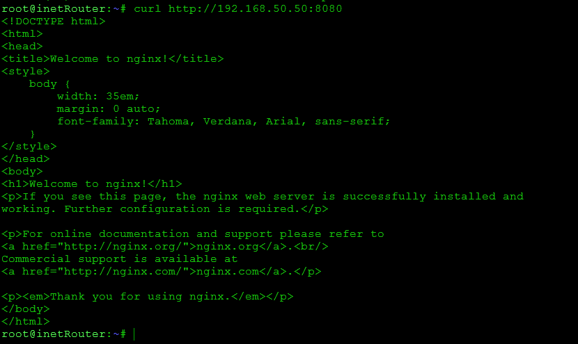

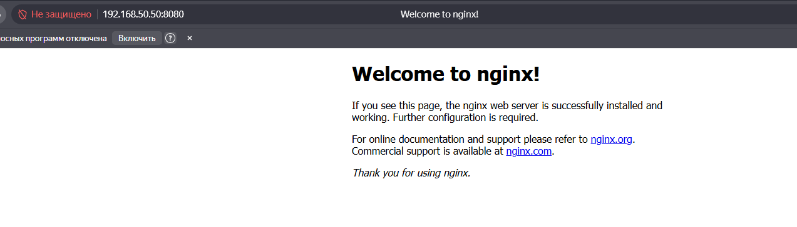

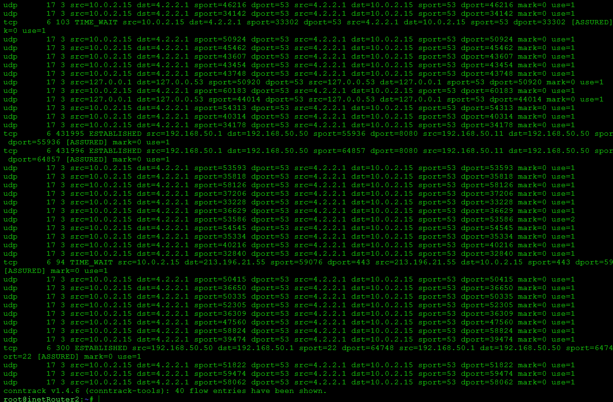

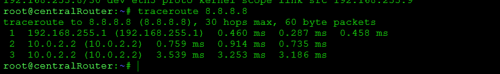