Домашнее задание VPN

Цель домашнего задания

- Создать домашнюю сетевую лабораторию. Научится настраивать VPN-сервер в Linux-based системах.
Описание домашнего задания
- Настроить VPN между двумя ВМ в tun/tap режимах, замерить скорость в туннелях, сделать вывод об отличающихся показателях
- Поднять RAS на базе OpenVPN с клиентскими сертификатами, подключиться с локальной машины на ВМ
- (*) Самостоятельно изучить и настроить ocserv, подключиться с хоста к ВМ


1. TUN/TAP режимы VPN

Схема сети:

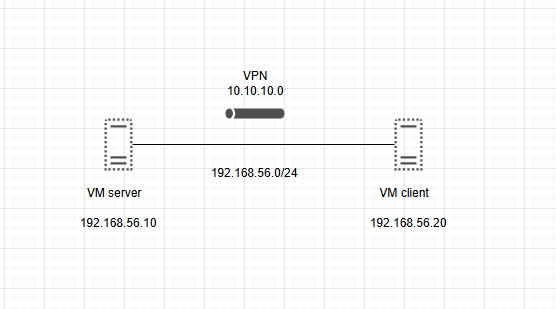

Для выполнения первого пункта необходимо написать Vagrantfile, который будет поднимать 2 виртуальные машины server и client.


После запуска машин из Vagrantfile необходимо выполнить следующие действия на server и client машинах:

# Устанавливаем нужные пакеты и отключаем SELinux  
```
apt update
apt install openvpn iperf3 selinux-utils
setenforce 0
```
Настройка хоста 1:

 	# Cоздаем файл-ключ 
       openvpn --genkey secret /etc/openvpn/static.key
	# Cоздаем конфигурационный файл OpenVPN 
	vim /etc/openvpn/server.conf


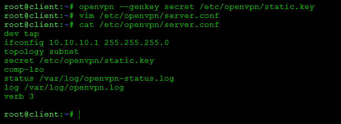


# Создаем service unit для запуска OpenVPN

 # Создаем service unit для запуска OpenVPN
     vim /etc/systemd/system/openvpn@.service
     # Содержимое файла-юнита

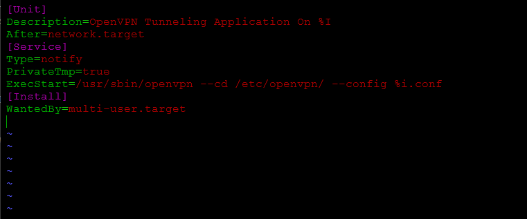

# Запускаем сервис 
```
systemctl start openvpn@server 
systemctl enable openvpn@server
```

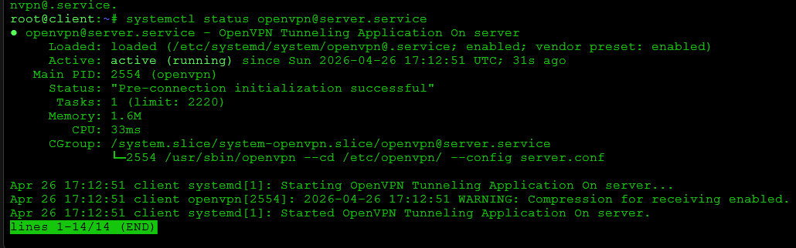

Настройка хоста 2: 

# Cоздаем конфигурационный файл OpenVPN 
vim /etc/openvpn/server.conf

# Содержимое конфигурационного файла  
dev tap 
remote 192.168.56.10 
ifconfig 10.10.10.2 255.255.255.0 
topology subnet 
route 192.168.56.0 255.255.255.0 
secret /etc/openvpn/static.key
comp-lzo
status /var/log/openvpn-status.log 
log /var/log/openvpn.log 
verb 3 


На хост 2 в директорию /etc/openvpn необходимо скопировать файл-ключ static.key, который был создан на хосте 1.  

	# Создаем service unit для запуска OpenVPN
     vim /etc/systemd/system/openvpn@.service
     # Содержимое файла-юнита
[Unit] 
Description=OpenVPN Tunneling Application On %I 
After=network.target 
[Service] 
Type=notify 
PrivateTmp=true 
ExecStart=/usr/sbin/openvpn --cd /etc/openvpn/ --config %i.conf 
[Install] 
WantedBy=multi-user.target
     # Запускаем сервис 
systemctl start openvpn@server 
systemctl enable openvpn@server

Далее необходимо замерить скорость в туннеле: 

На хосте 1 запускаем iperf3 в режиме сервера: iperf3 -s & 
На хосте 2 запускаем iperf3 в режиме клиента и замеряем  скорость в туннеле: iperf3 -c 10.10.10.1 -t 40 -i 5 


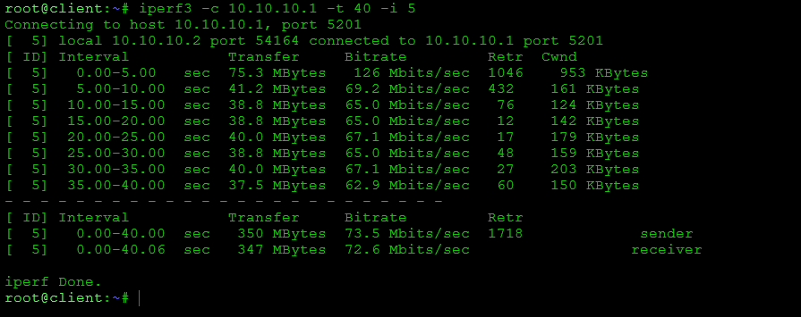

Повторяем пункты 1-2 для режима работы tun. 
Конфигурационные файлы сервера и клиента изменятся только в директиве dev. Делаем выводы о режимах, их достоинствах и недостатках.

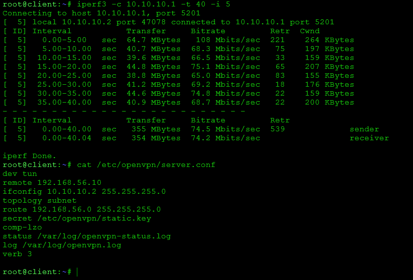


2. RAS на базе OpenVPN 

Для выполнения данного задания можно воспользоваться Vagrantfile из  1 задания, только убрать одну ВМ. После запуска отключаем SELinux (setenforce 0) или создаём правило для него. 

# Устанавливаем необходимые пакеты 
```
apt update
apt install -y openvpn easy-rsa
```
в server.conf путь к ca должен указывать на реально существующий файл. В стандартной сборке Easy-RSA сертификаты и ключи лежат в /etc/openvpn/pki. Но openvpn --genkey secret ca.key создаёт не сертификат CA, а статический ключ, и он не подходит вместо ca.crt. Для OpenVPN-схемы с сертификатами нужен именно CA-сертификат, а не ca.key.

# Переходим в директорию /etc/openvpn и инициализируем PKI
```
cd /etc/openvpn
make-cadir pki
cd /etc/openvpn/pki
./easyrsa init-pki
```
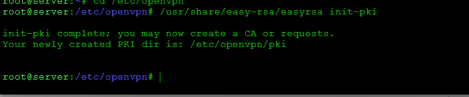

# Генерируем необходимые ключи и сертификаты для сервера 
```
Создайте CA:
./easyrsa build-ca nopass
Команда создаст ca.crt и ca.key. Для учебного стенда nopass удобно.
Создайте сертификат и ключ сервера:
./easyrsa gen-req server nopass
echo yes | ./easyrsa sign-req server server
Сгенерируйте Diffie-Hellman параметры:
./easyrsa gen-dh
```

# Генерируем необходимые ключи и сертификаты для клиента

```
./easyrsa gen-req client nopass
echo yes | ./easyrsa sign-req client client
каталог для client-config-dir:
mkdir -p /etc/openvpn/client
```

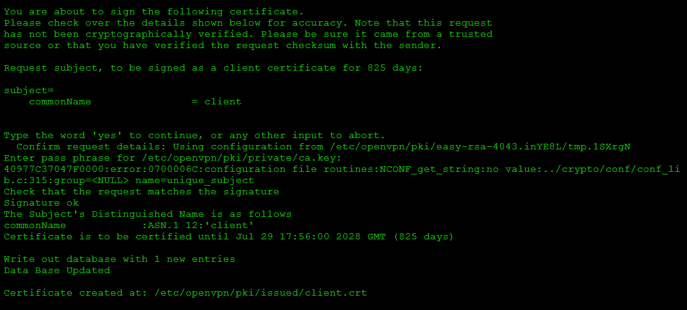

# Создаем конфигурационный файл сервера 

```
cat > /etc/openvpn/server.conf <<'EOF'
port 1207
proto udp
dev tun
ca /etc/openvpn/pki/ca.crt
cert /etc/openvpn/pki/issued/server.crt
key /etc/openvpn/pki/private/server.key
dh /etc/openvpn/pki/dh.pem
server 10.10.10.0 255.255.255.0
ifconfig-pool-persist ipp.txt
client-to-client
client-config-dir /etc/openvpn/client
keepalive 10 120
comp-lzo
persist-key
persist-tun
status /var/log/openvpn-status.log
log /var/log/openvpn.log
verb 3
EOF
```

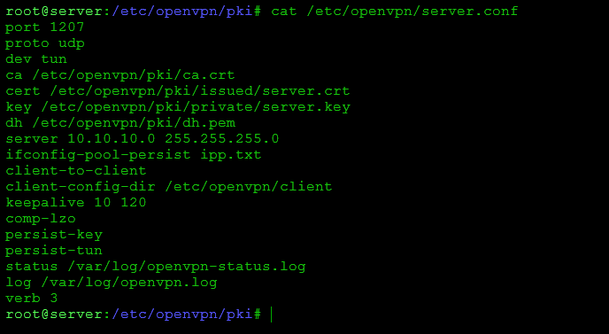

Это основной конфиг OpenVPN-сервера.
# Зададим параметр iroute для клиента

echo 'iroute 10.10.10.0 255.255.255.0' > /etc/openvpn/client/client


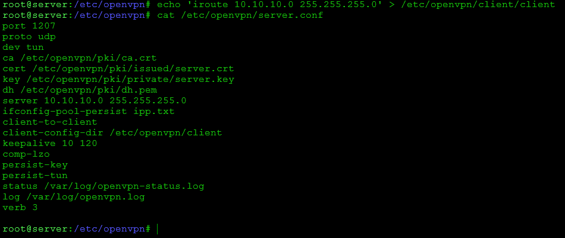


# Запускаем сервис (при необходимости создать файл юнита как в задании 1) 

systemctl start openvpn
systemctl enable openvpn

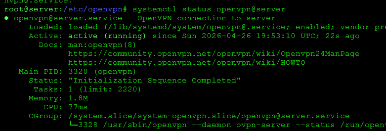

На хост-машине: 

1) Необходимо создать файл client.conf со следующим содержимым: 
	dev tun 
proto udp 
remote 192.168.56.10 1207 
client 
resolv-retry infinite 
remote-cert-tls server 
ca ./ca.crt 
cert ./client.crt 
key ./client.key 
route 192.168.56.0 255.255.255.0 
persist-key 
persist-tun 
comp-lzo 
verb 3 
2) Скопировать в одну директорию с client.conf файлы с сервера:     	   
/etc/openvpn/pki/ca.crt 
/etc/openvpn/pki/issued/client.crt 
/etc/openvpn/pki/private/client.key

Далее можно проверить подключение с помощью: openvpn --config client.conf

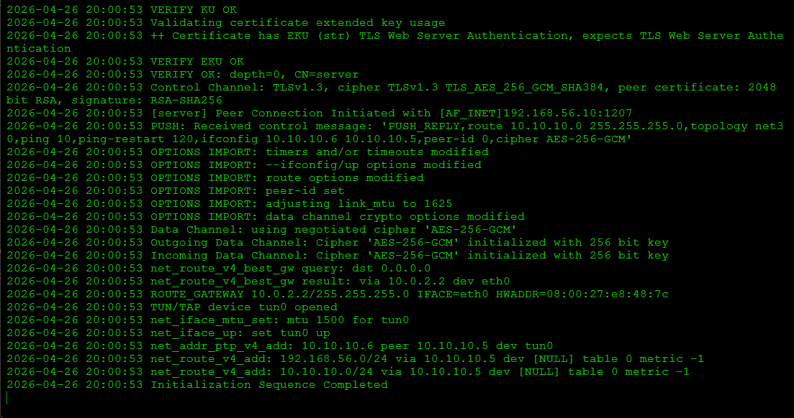


